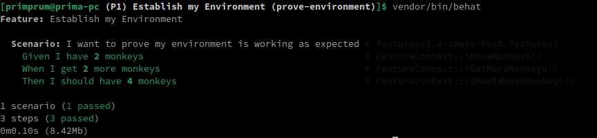
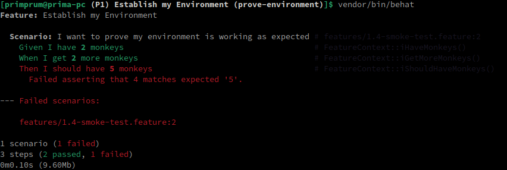

## Testing the environment (PHP Behat)

In this project, we're gonna create a simple smoke test for the purpose of proving that the environment we make with Behat is working as it's supposed to be.

So, based on that understanding, this test will going to have the following characteristics:

- Making sure the environment is working
- Eliminate dependencies and complexity
- Do not worry about HTTP, JSON, authentication, Github or anything else yet

<br>

### Feature file

Our feature will be like this:

```gherkin
Feature: Establish my Environment
	Scenario: I want to prove my environment is working as expected
		Given I have 2 monkeys
		When I get 2 more monkeys
		Then I should have 4 monkeys
```

This is basically just an arithmetic test to confirm relationship between `Given`, `When`, and `Then`.

<br>

### Generating the function

Like usual, we generate the function on our workspace by typing command on the terminal:

```bash
vendor/bin/behat
```

<br>

### Generated function

From that command, we'll get the following functions:

```php
/**
 * @Given I have :arg1 monkeys
 */
public function iHaveMonkeys($arg1)
{
    // stuff
}

/**
 * @When I get :arg1 more monkeys
 */
public function iGetMoreMonkeys($arg1)
{
    // stuff
}

/**
 * @Then I should have :arg1 monkeys
 */
public function iShouldHaveMonkeys($arg1)
{
    // stuff
}
```

<br>

### Given: I have 2 monkeys

This generates function `iHaveMonkeys($arg1)`.

The parameter `$arg1` took value `2` from the Gherkin code.

Before we could assign from parameter into the variable, we need to declare variable outside all the functions and give it initial value:

```php
protected $monkeyCount = 0;
```

Now, we could write it like this:

```php
/**
 * @Given I have :arg1 monkeys
 */
public function iHaveMonkeys($arg1)
{
    $this->monkeyCount = (int) $arg1;
}
```

Notice that we use Integer for the data type, because monkey can't be Float type.

So, in this feature example:

```gherkin
Given I have 2 monkeys
```

The value `2` will be assigned into `$this->monkeyCount`.

<br>

### When: I get 2 more monkeys

This generates function `iGetMoreMonkeys($arg1)`.

Then we'll write the function:

```php
/**
 * @When I get :arg1 more monkeys
 */
public function iGetMoreMonkeys($arg1)
{
    $this->monkeyCount += (int) $arg1;
}
```

We've already assigned the value `2` into `$this->monkeyCount` by calling function `iHaveMonkeys($arg1)`.

Now in `iGetMoreMonkeys($arg1)`, we'll take value from `$arg1` and add it into already-assigned variable `$this->monkeyCount` again.

Our feature file:

```gherkin
When I get 2 more monkeys
```

So, `2` + `2` logically should equals `4`

<br>

### Then: I should have 4 monkeys

This generates function `iShouldHaveMonkeys($arg1)`.

The function we're about to write should be able to assert our arithmetic logic from previously written feature file:

```gherkin
Given I have 2 monkeys
When I get 2 more monkeys
Then I should have 4 monkeys
```

We need to make sure that sample above should passed the test, and sample below should failed the test:

```gherkin
Given I have 2 monkeys
When I get 2 more monkeys
Then I should have 5 monkeys
```

So, our function will be like this:

```php
/**
 * @Then I should have :arg1 monkeys
 */
public function iShouldHaveMonkeys($arg1)
{
    Assert::assertEquals($arg1, $this->monkeyCount);
}
```

The parameter `$arg1` here should match the arithmetic result from 2 previous functions which is on variable `$this->monkeyCount`.

In order to use function `assertEquals()`, we're gonna use `Assert` class from PHPUnit, so we need to import it too:

```php
use PHPUnit\Framework\Assert;
```

<br>

### Running the test

Run behat from terminal:

```bash
vendor/bin/behat
```

Test result:



Failed test:



This proves that the assertion works properly.

<br>

### Understand test flow

- **Feature Description** <br> The feature file describes the scenario of establishing an environment and ensuring it functions correctly.

- **Scenario** <br> The scenario outlines the steps to verify that adding monkeys to the environment works as expected.

- **Given Step** <br> Sets up the initial state by specifying the number of monkeys in the environment.
  When Step: Specifies the action of adding more monkeys to the environment.

- **Then Step** <br> Asserts that the final state of the environment matches the expected number of monkeys.

<br>

### What does this test tell us?

- The test scenario executes successfully, indicating that the environment setup and monkey addition functionalities are working as expected.
- The assertion in the "Then" step correctly verifies whether the number of monkeys matches the expected count.
- Changing the expected count in the assertion to see if the test fails demonstrates the test's ability to catch discrepancies.

> In summary, this smoke test effectively verifies the basic functionality of managing monkeys in the environment, providing confidence that the system is functioning as intended.
